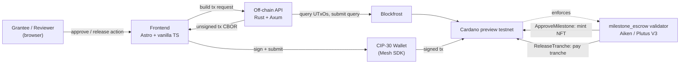

# Catalyst Accountability Tracker

An MVP project by Online Group 03, at [DDiB 2026 program](https://www.blockchain.uzh.ch/courses/ddib26/), University of Zürich.

Contributors:

- [Ishaaq Ziyan](github.com/ishaaqziyan)

- [Gurvy Kavei](github.com/Gurvy-dotcom)

- Philip Wakah

A single Aiken validator that binds milestone approval to tranche release as
one on-chain state machine: a tranche cannot pay out unless the matching
milestone approval already exists on-chain. 
Each approved milestone mints a
soulbound NFT as public, verifiable proof of delivery.

## Status

The full flow — create grant → approve all 3 milestones → release
all 3 tranches — has been run end-to-end on Cardano `preview` testnet and
independently verified on-chain via Blockfrost:

- Escrow deployed at `testnet-v3` (see [`onchain/deploy/README.md`](onchain/deploy/README.md)
- All 3 milestones approved, all 3 tranches released, escrow UTxO fully
  drained, 100 ADA distributed to the grantee across the 40/30/30 split

Not yet done: an explicit negative test that `ReleaseTranche(N)` rejects
before `ApproveMilestone(N)` succeeds, and a fresh deploy for a repeatable
demo (the current `testnet-v3` escrow is now fully spent).

## Architecture

| Layer | Tech | Role |
|---|---|---|
| On-chain | Aiken (Plutus V3) | Single combined validator: milestone registry + treasury escrow ([`onchain/`](onchain/)) |
| Off-chain | Rust + Axum + Blockfrost | Builds unsigned tx CBOR; never signs or submits ([`offchain/`](offchain/)) |
| Frontend | Astro + vanilla TS | Wallet connect, approve/release UI, progress bar ([`frontend/`](frontend/)) |
| Wallet | CIP-30 (Mesh SDK) | Client-side signing and submission |

Redeemers on `milestone_escrow`:

- `ApproveMilestone(index)` — requires the reviewer's signature; marks the
  milestone approved; mints one Milestone Receipt NFT.
- `ReleaseTranche(index)` — requires `index == released_count` (strictly
  sequential) and the milestone already approved; pays out that tranche's
  share of the original locked amount to the grantee.



See each subdirectory's own README for details:
[`onchain/README.md`](onchain/README.md),
[`offchain/README.md`](offchain/README.md),
[`frontend/README.md`](frontend/README.md).

## Running it locally

```sh
# 1. on-chain: compile the validator (only needed after an Aiken change)
cd onchain && aiken build

# 2. off-chain API (needs BLOCKFROST_PROJECT_ID — see offchain/.env.example)
cd offchain && cp .env.example .env && cargo run

# 3. frontend
cd frontend && npm install && npm run dev
```

Frontend defaults to `http://localhost:4321`, API to `http://localhost:3000`.

## Running it with Docker

Requires Docker + Docker Compose. Needs `offchain/.env` first (see
[Secrets](#secrets) below, or copy `offchain/.env.example`).

```sh
docker compose up --build
```

Starts `offchain` (port `3000`) and `frontend` (port `4321`). Frontend
gets `PUBLIC_API_BASE_URL=http://localhost:3000` baked in via compose.
On-chain build (`aiken build`) is not part of the compose stack — run it
separately if you've changed the validator.

Stop with `docker compose down`.

## Just recipes

Requires [`just`](https://github.com/casey/just). `just --list` shows all of
these; the commands under "Running it locally" above are what they wrap.

| Recipe | Does |
|---|---|
| `just setup` | `frontend-install` + `onchain-build` |
| `just up` | `offchain-up` + `frontend-up` (both backgrounded) |
| `just all-up` | `onchain-build` + `frontend-up`, then `offchain-run` in the foreground (Ctrl-C to stop) |
| `just down` | `offchain-down` + `frontend-down` |
| `just status` | `offchain-status` + `frontend-status` |
| `just onchain-build` | `cd onchain && aiken build` |
| `just onchain-check` | `cd onchain && aiken check` |
| `just offchain-build` | `cd offchain && cargo build` |
| `just offchain-test` | `cd offchain && cargo test` |
| `just offchain-run` | `cd offchain && cargo run` (foreground) |
| `just offchain-up` | same, backgrounded via `nohup`, logs to `offchain/.offchain.log` |
| `just offchain-down` | kills the backgrounded offchain process |
| `just offchain-logs` | `tail -f offchain/.offchain.log` |
| `just offchain-status` | curls `/grants` and prints the HTTP status |
| `just frontend-install` | `cd frontend && npm install` |
| `just frontend-up` / `frontend-down` / `frontend-status` | `astro dev --background` / `astro dev stop` / `astro dev status` |
| `just decrypt-env <file>` | `sops -d` a `<file>.enc` into `<file>` |
| `just encrypt-env <file>` | `sops -e` a `<file>` into `<file>.enc` |

## Secrets

Every `.env` in this repo is gitignored. Encrypted copies (`*.env.enc`,
readable with [`sops`](https://github.com/getsops/sops) + an
[`age`](https://github.com/FiloSottile/age) key, config in
[`.sops.yaml`](.sops.yaml)) are safe to commit and are how secrets get
shared/version-controlled instead:

```sh
# decrypt
sops --input-type dotenv --output-type dotenv -d offchain/.env.enc > offchain/.env

# re-encrypt after editing
sops --input-type dotenv --output-type dotenv -e offchain/.env > offchain/.env.enc
```
